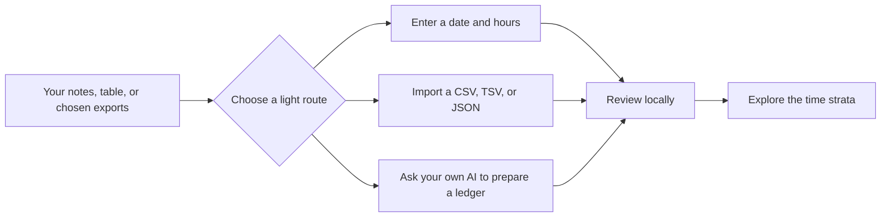

# AI Usage Strata

[简体中文](README.zh-CN.md) · [Live app](https://yiweicreates.github.io/ai-usage-strata/) · [Stable v1.0.0](https://github.com/YiweiCreates/ai-usage-strata/releases/tag/v1.0.0) · [How to use AI to prepare a ledger](docs/ai-assisted-import.md) · [Ledger format](docs/ledger-format.md) · [Contribute](CONTRIBUTING.md) · [Launch kit](docs/launch/README.md) · [MIT License](LICENSE)

> A local-first visual ledger for the time, text, and work you do with AI.


## v1.0.0 stable release

- Starts at zero; data appears only after you enter it, import it, or deliberately open the fictional example.
- Supports manual entry, CSV/TSV/JSON, and a review-first route through your own Codex, Claude Code, or another AI.
- Date wheels apply on click, cover 1900–2100 by default, and extend for imported out-of-range records. Invalid start/end combinations produce a visible page-level warning.
- Chinese and English, light and dark themes, category filters, day evidence, and the rotatable waterfall now form one complete path.

This is the frozen stable baseline. Further improvements continue through GitHub Issues and pull requests, without bringing real ledgers into the public repository.

## One question, made visible

AI can make a week feel busy without making its shape legible. You may remember that you used it a lot, but not when work gathered momentum, where it went, or what a peak day was connected to.

AI Usage Strata turns a small ledger that you choose to keep into a visual record you can inspect. It is not a surveillance dashboard, a payroll tracker, or a cloud account. It is a private instrument for looking back at your work with enough evidence to trust the story it tells.


## What it helps you do

| If you want to ask… | You can look at… | Then act on… |
| --- | --- | --- |
| When did work intensify? | A rotatable waterfall of smooth monthly ridges | A peak day, its date, and its evidence |
| Where did the time go? | Filterable weekly or monthly allocation strips | The work directions that dominated a period |
| How much did I exchange with AI? | Time, input, and output views for the same dates | A comparable baseline for a sprint, month, or project |
| Which numbers can I rely on? | Recorded values beside explicit estimate ranges | A conclusion that does not hide uncertainty |
| What happened on that day? | A day-level evidence page | The note, draft, log, or link you chose to retain |

## Who it is for

| You might be… | This is useful when… |
| --- | --- |
| An independent researcher, writer, designer, or developer | Your AI work is spread across tools and you want one honest retrospective view. |
| A small team lead or project owner | You want to review a project’s rhythm without asking people to hand over chat logs. |
| A personal knowledge-system builder | You already keep lightweight activity records and want to see their longer-term pattern. |
| Someone testing AI-assisted work habits | You want a private before/after record instead of a vague feeling that “AI changed everything.” |

It is deliberately not for employee surveillance, hidden analytics, automated chat scraping, or turning estimates into performance scores.

## See the whole shape, then trace one day

<p align="center">
  
</p>

Each ridge represents a month. Read dates across the ridge; height represents the chosen daily measure. Switch between Time, Input, and Output. Use front, side, back, or top views to inspect the same record from different angles.

Every date mark that has evidence can lead to its day page. There, the tool keeps a plain distinction:

| Mark | Meaning |
| --- | --- |
| Recorded | A value you explicitly put in the ledger. |
| Estimated | A reconstruction with its reason kept alongside it. |

The tool will never quietly fill a blank day and present it as a fact.

## Start in three minutes



1. Open the [live app](https://yiweicreates.github.io/ai-usage-strata/). It starts with no data, by design.
2. Choose “View example” to explore a fictional Atlas Lab case: rotate the waterfall, choose a category, change Time to Input or Output, and open a date mark.
3. Choose “Start entering” and add a date plus hours; that is enough for a first record.
4. Choose “Ask AI to organise” if your record is scattered. Copy the generated task into Codex, Claude Code, or another AI; it returns `ai-usage-ledger.json`, which you review and import. No API key is needed.
5. Or import an existing table: [`examples/table-ledger-example.csv`](examples/table-ledger-example.csv) shows the accepted CSV shape. CSV and TSV headers such as `date`, `hours`, `category`, `input`, `output`, and `count` are suggested automatically, then shown for you to confirm or remap before anything is saved.
6. JSON is optional: [`examples/minimal-ledger.json`](examples/minimal-ledger.json) is the portable backup and advanced-editing format. Add a `reference_window` if there is a sprint, audit, or reporting period you revisit often.
7. Export your ledger for a portable backup whenever you want.

On macOS, double-click `启动·AI Usage Strata.command`. It starts a local-only server at `127.0.0.1:8770` and opens the app. On other systems, serve this folder with any static-file server and open `index.html`.

## Start with your notes, not with code

You do not need to export a complete chat history or write JSON. The in-page ledger builder asks first for only a date and hours. If you already keep notes in a spreadsheet, save it as CSV/TSV and import it. The app converts common columns into its portable ledger format locally.

| Spreadsheet header | Mapped ledger field |
| --- | --- |
| `日期` / `date` | date |
| `小时` / `hours`, or `分钟` / `minutes` | hours |
| `分类` / `category` | category |
| `输入` / `input`, `输出` / `output`, `次数` / `count` | optional usage fields |

JSON is the small, portable format the app saves and exports. One row can be one day, one session, or one event — as long as you use your own convention consistently.

```json
{
  "date": "2026-07-24",
  "hours": 2.5,
  "input_chars": 4800,
  "output_chars": 12600,
  "activity_count": 3,
  "category": "Research",
  "confidence": "recorded",
  "evidence": [{ "type": "note", "label": "Daily research note" }]
}
```

If you reconstruct a day, use `"confidence": "estimated"` and add a short `estimate_basis`. The full field guide, including the saved reference period, is in [docs/ledger-format.md](docs/ledger-format.md).

## Let AI do the formatting, not the deciding

The app has two AI-assisted routes. Both are optional and both keep the website
out of the exchange between you and an AI provider.

| Route | Best for | What happens |
| --- | --- | --- |
| Ask AI to organise | Most people; scattered notes, exports, or a local AI conversation | Copy the in-app task, tell the AI exactly what it may read, then import its `ai-usage-ledger.json`. |
| Local AI writes | A local Codex or Claude Code session already working in a folder you control | Confirm the security boundary, then let it read only named sources and write only `ai-usage-ledger.json`. |

For either route, the AI must label direct facts as `recorded`, reconstructions
as `estimated` with `estimate_basis`, and omit days without evidence. A cloud
or web AI cannot safely inspect your computer: it can use only material you
choose to upload or paste. The complete step-by-step guide is
[here](docs/ai-assisted-import.md); a reusable local-agent instruction is in
[`integrations/local-ai/AI_USAGE_STRATA.md`](integrations/local-ai/AI_USAGE_STRATA.md).

## Local-first means a concrete boundary

| The app does | The app does not do |
| --- | --- |
| Read the form entry or JSON/CSV/TSV file you deliberately select | Scan your chats, files, calendar, repository, or browser |
| Keep the imported copy in that browser’s local storage | Upload, sync, track, or analyse your data remotely |
| Let you export or reset the copy | Create an account or make hidden network requests |

The “Ask AI to organise” button only creates a task brief in your browser. It
does not connect to any AI account. If you use a local coding AI, its file
permissions are controlled by you and that AI environment, never by this site.

Before sharing a ledger or screenshot, remove labels and links that could identify a client, collaborator, local path, or raw chat content. Read the full [privacy and safe-use notes](docs/privacy.md).

## Contribute or adapt it

This project is MIT-licensed and designed to be extended without weakening its privacy boundary. Useful contributions include accessibility improvements, translations, import adapters, example ledgers, visual refinements, and documentation.

- [How to contribute](CONTRIBUTING.md)
- [Security policy](SECURITY.md)
- [Report a bug or propose a feature](https://github.com/YiweiCreates/ai-usage-strata/issues)
- [Release safety checklist](docs/release-checklist.md)

## Project and licence

AI Usage Strata is made by Yiwei at Tianyu Vision. The source, releases,
issues, and contribution history live at
[github.com/YiweiCreates/ai-usage-strata](https://github.com/YiweiCreates/ai-usage-strata).

The code is available under the [MIT License](LICENSE). If the tool gives you
an idea, finds a rough edge, or needs to support a better import path, please
[open an issue](https://github.com/YiweiCreates/ai-usage-strata/issues) or
send a focused pull request. Keep all real ledgers and identifiable evidence
out of public issues and branches.

Before opening a public pull request, run:

```bash
python3 scripts/validate_ledger.py examples/minimal-ledger.json
python3 scripts/release_audit.py
```

Code: MIT © 2026 Yiwei · Tianyu Vision. The included Atlas Lab ledger and every screenshot in this README are fictional.
