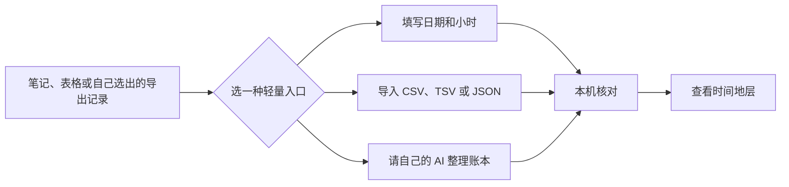

# AI Usage Strata

[English](README.md) · [在线体验](https://yiweicreates.github.io/ai-usage-strata/) · [稳定版 v1.0.0](https://github.com/YiweiCreates/ai-usage-strata/releases/tag/v1.0.0) · [让 AI 整理账本](docs/ai-assisted-import.zh-CN.md) · [账本格式](docs/ledger-format.md) · [参与贡献](CONTRIBUTING.md) · [发布素材](docs/launch/README.zh-CN.md) · [MIT 许可证](LICENSE)

> 一个本机优先的可视化账本：把你和 AI 一起工作的时间、文字量与去向，变成一段可回看的记录。


## v1.0.0 稳定版

- 默认从 0 开始；只有主动填写、导入或打开虚构示例后才会出现数据。
- 支持手填、CSV／TSV／JSON，以及让自己的 Codex、Claude Code 或其他 AI 先整理再导入。
- 日期滚轮可直接点选，默认覆盖 1900—2100 年；导入更早或更晚的记录时会继续扩展。无效起止日期会在页面上方明确提醒。
- 中英文、明暗主题、分类筛选、日期证据页和可旋转的瀑布山脊图已经组成完整使用链路。

这是当前冻结的稳定基线。后续改进通过 GitHub Issue 和 Pull Request 继续，不会把真实账本带进公开仓库。

## 它想回答的，其实只有一个问题

AI 会让一周显得很忙，但忙碌的形状往往不清楚。你可能记得自己“最近一直在用 AI”，却说不清哪几天真正进入了高强度工作、时间主要花到哪里、某个高峰到底连着什么具体活动。

AI Usage Strata 把你主动保留的一小份账本，变成一个可以查看、筛选、回溯的工作记录。它不是监控面板，不是工时打卡，也不是把数据交给云端的账户系统；它更像一件私人的测量工具，让你回看自己的 AI 协作时，能看见轨迹，也能看见依据。


## 它能帮你做什么

| 你想问什么 | 可以看什么 | 最后得到什么 |
| --- | --- | --- |
| 我什么时候最投入？ | 可旋转的月度瀑布山脊图 | 高峰日期，以及那天保留的证据 |
| 时间具体花到哪了？ | 可勾选的周／月分类条带 | 某段时间真正占主导的工作去向 |
| 我和 AI 交换了多少内容？ | 同一时间范围里的时间、输入、输出切换 | 可比较的月度、冲刺期或项目基线 |
| 这些数靠谱吗？ | 已记录值与估算区间并列显示 | 不把不确定性藏起来的判断 |
| 某天具体发生了什么？ | 按天的证据页 | 你选择留下的笔记、草稿、日志或链接 |

## 谁可能会需要它

| 你可能是… | 适合用在… |
| --- | --- |
| 独立研究者、写作者、设计师或开发者 | AI 工作散落在不同工具里，想做一次诚实的回顾。 |
| 小团队负责人或项目主理人 | 想看项目节奏，但不想要求大家交出聊天记录。 |
| 正在搭个人知识系统的人 | 已经有轻量活动记录，希望看见长期变化。 |
| 想检验 AI 是否改变工作习惯的人 | 想用自己的前后记录判断，而不是只凭感觉。 |

它刻意不用于员工监控、隐形分析、自动抓取聊天记录，或把估算做成绩效分数。

## 先看整体，再回到某一天

<p align="center">
  
</p>

每一层山脊对应一个月：横向读日期，山峰高度表示当天选中的指标。你可以在时间、输入、输出之间切换；也可以切到前视、侧视、后视、俯视，从不同角度看同一段记录。

带有证据的日期刻痕可以打开当天页面。页面只保留两个清楚的判断：

| 标识 | 意思 |
| --- | --- |
| 已记录 | 你明确写进账本的数字。 |
| 估算 | 根据已有记录补出的范围，旁边会保留理由。 |

空白不会被悄悄填成事实。

## 三分钟上手



1. 先打开[在线页面](https://yiweicreates.github.io/ai-usage-strata/)，它会有意从“没有数据”开始。
2. 点“查看示例”后，才会加载 Atlas Lab 虚构案例；再试着旋转瀑布图、勾选分类、切换时间／输入／输出，并打开一个日期刻痕。
3. 点“开始填写”，先记一条日期和小时数；这已经足够形成第一条记录。
4. 如果记录很零散，点“让 AI 整理”：把页面生成的任务说明贴进 Codex、Claude Code 或其他 AI；它会输出 `ai-usage-ledger.json`，你检查后再导入。这里不需要 API Key。
5. 或导入已有表格：[`examples/table-ledger-example.csv`](examples/table-ledger-example.csv) 展示了 CSV 写法。CSV／TSV 中的 `日期/date`、`小时/hours`、`分类/category`、`输入/input`、`输出/output`、`次数/count` 会先自动建议对应关系，再由你确认或手动改列；确认前不会写入账本。
6. JSON 是选填：[`examples/minimal-ledger.json`](examples/minimal-ledger.json) 是方便备份、迁移和高级编辑的格式；如果有经常回看的冲刺期、审计期或报告期，再加上 `reference_window`。
7. 需要备份时，导出自己的账本。

macOS 可以直接双击 `启动·AI Usage Strata.command`。它只会在本机启动 `127.0.0.1:8770` 并打开页面。其他系统用任意静态文件服务器打开此目录即可。

## 先写你的记录，不需要先写代码

你不需要导出完整聊天史，也不需要写 JSON。页面里的轻量填写器只会先问你日期和小时数；如果你本来就在表格里记，存成 CSV／TSV 后导入即可。页面会在本机把常见列转换为可携带的账本格式。

| 表格表头 | 转换后的字段 |
| --- | --- |
| `日期` / `date` | 日期 |
| `小时` / `hours`，或 `分钟` / `minutes` | 小时数 |
| `分类` / `category` | 工作分类 |
| `输入` / `input`、`输出` / `output`、`次数` / `count` | 可选的用量字段 |

JSON 是页面保存和导出的轻量、可携带格式。一行可以代表一天、一次工作会话或一个事件；重点是你自己的记录口径前后一致。

```json
{
  "date": "2026-07-24",
  "hours": 2.5,
  "input_chars": 4800,
  "output_chars": 12600,
  "activity_count": 3,
  "category": "Research",
  "confidence": "recorded",
  "evidence": [{ "type": "note", "label": "当天研究笔记" }]
}
```

如果某天是补估，标为 `"confidence": "estimated"`，并写一条 `estimate_basis` 说明依据。完整字段和“参考期”写法见 [docs/ledger-format.md](docs/ledger-format.md)。

## 让 AI 做格式整理，不替你做事实判断

页面提供两条可选的 AI 协助路径，两条都不会让本网站介入你和 AI 服务商之间的数据交换。

| 路径 | 适合谁 | 怎么做 |
| --- | --- | --- |
| 请 AI 整理 | 大多数人；记录散落在笔记、导出文件或本地 AI 对话里 | 复制页面任务说明，明确告诉 AI 能读什么；让它输出 `ai-usage-ledger.json`，再自行导入。 |
| 本地 AI 写入 | 已在指定目录中工作的本地 Codex 或 Claude Code | 确认安全边界后，只允许它读取指定资料、只写 `ai-usage-ledger.json`。 |

无论哪条路径，来源里直接存在的数字才标为 `recorded`；反推数字必须标为 `estimated` 并写 `estimate_basis`；没有证据的日期不写。Cloud／网页端 AI 不会、也不应查看你的电脑，只能使用你主动上传或粘贴的材料。完整步骤见[用自己的 AI 整理账本](docs/ai-assisted-import.zh-CN.md)；可复用的本地 AI 任务说明在[`integrations/local-ai/AI_USAGE_STRATA.zh-CN.md`](integrations/local-ai/AI_USAGE_STRATA.zh-CN.md)。

## “本机优先”是一个明确边界

| 它会做 | 它不会做 |
| --- | --- |
| 读取你主动填写的内容，或主动选择的 JSON／CSV／TSV 文件 | 扫描你的聊天、文件、日历、仓库或浏览器 |
| 把导入副本留在当前浏览器本地存储 | 上传、同步、追踪或远程分析你的数据 |
| 让你导出或重置这份副本 | 创建账户或发起隐藏网络请求 |

“让 AI 整理”按钮只会在浏览器里生成任务说明，不会连接任何 AI 账号。若你使用本地编程 AI，文件权限只由你和该 AI 环境决定，不会由本网站获取或授予。

分享账本或截图前，请移除可能识别客户、协作者、本地路径或原始聊天内容的标签和链接。完整边界见[隐私与安全使用说明](docs/privacy.md)。

## 欢迎一起把它做得更好

项目使用 MIT 许可，也欢迎在不突破隐私边界的前提下继续生长：无障碍优化、翻译、更好的导入适配器、示例账本、视觉改进和文档都很有价值。

- [参与贡献说明](CONTRIBUTING.md)
- [安全政策](SECURITY.md)
- [报告问题或提出功能建议](https://github.com/YiweiCreates/ai-usage-strata/issues)
- [公开发布检查清单](docs/release-checklist.md)

## 项目与许可证

AI Usage Strata 由 Yiwei 在天与视界完成。源码、发行版本、问题反馈和贡献记录都在
[github.com/YiweiCreates/ai-usage-strata](https://github.com/YiweiCreates/ai-usage-strata)。

代码采用 [MIT License](LICENSE)。如果它让你想到新的用法、发现需要打磨的地方，或希望支持新的导入路径，欢迎在 GitHub
[提交问题或建议](https://github.com/YiweiCreates/ai-usage-strata/issues)，也欢迎提交边界清楚的 Pull Request。公开 issue 和分支里请不要放真实账本、可识别的证据或个人数据。

提交公开 PR 前，先运行：

```bash
python3 scripts/validate_ledger.py examples/minimal-ledger.json
python3 scripts/release_audit.py
```

代码采用 MIT License © 2026 Yiwei · 天与视界。README 中的 Atlas Lab 账本与所有截图均为虚构示例。
